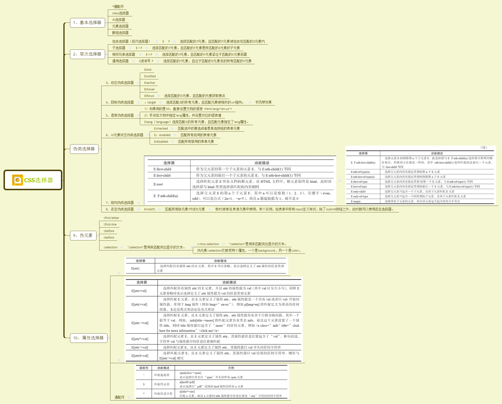

### 1.有一个父元素它的透明度是 opacity：0.5，子元素我给它设置为 1； 这个子元素的透明度是多少？  
```
父元素设置opacity属性后，子元素再设置此属性是在父元素的基础上设置的，因此子元素的opacity是0.5
```
### 2.如何给子元素设置opacity为1
```
父元素不用opacity，设置background: rgba()。
```
### 3.常见的水平垂直居中实现方案
```css
/* flex布局 */
.parent {
  display: flex;
  justify-content: center;
  align-items: center;
}

/* 绝对定位 */
.parent {
  position: relative;
}
.child {
  position: absolute;
  top: 0; left: 0; right: 0; bottom: 0;
  margin: auto;
}

/* 绝对定位配合transform */
.parent {
  position: relative;
}
.child {
  position: absolute;
  top: 50%; left: 50%;
  transform: translate(-50%, -50%);
}

```
### 4.BFC
```
BFC 即 Block Formatting Contexts (块级格式化上下文)，通俗一点来讲，可以把 BFC 理解为一个封闭的大箱子，箱子内部的元素无论如何翻江倒海，都不会影响到外部。

1. 根元素
2. float的值不为none
3. overflow的值不为visible
4. display的值为 inline-block/ table-cell/ table-caption/ flex/ inline-flex 
5. position的值为absolute或fixed

1. Box垂直方向的距离由margin决定，属于同一个BFC的两个相邻box的margin会发生重叠（应用：防止marin重叠）
2. BFC的区域不会与float box发生重叠（应用：自适应两栏布局）
3. 计算BFC的高度时，浮动元素也参与计算（应用：清除内部浮动）
4. BFC内部的Box会在垂直方向，一个接一个的放置。
5. 每个元素的margin box的左边会与包含块border box的左边相接触（对于从左到右的格式化，否则相反），即使存在浮动也会如此。
6. BFC就是页面上的一个独立容器，容器里面的元素不会影响到外面的元素
```
### 5.flex: 1
```
flex: 1; 是flex-grow: 1; flex-shrink: 1; flex-basis: 0%;
```
### 6.隐藏元素的属性
```css
display: none;  不占空间
visibility: hidden; 占空间，内容隐藏，触摸不到
opacity: 0; 占空间，能触摸到
```
### 7.样式引入，link和@import的区别
```
1. link属于html标签，@import属于css提供的
2. 页面被加载时，link会同时被加载，而@import引用的css会等到页面被加载完再加载
3. @import只在IE5以上才能识别，link是xhtml标签，无兼容问题。
4. link方式的样式权重高于@import的权重。
```
### 8.css选择器


### 9.display: inline-block什么时候会显示间隙？
```
display-inline-block是让元素在一行显示，但是这些元素在html里面是上下行排列的，所以中间有换行符，于是并排显示就有了换行符带来的空隙。那么如何解决呢？
方案一：将html标签要display:inline-block 的元素写在一行。缺点：代码可读性差。

方案二：给父元素设置font-size:0,缺点是子元素如果里面有文字，文字会消失不见，所以又要给子元素设置font-size:0,增加了代码量。

方案三：给元素设置float:left,缺点高度塌陷，要清楚浮动。

方案四：设置子元素的margin-left为负值，但是元素之间的间隙大小是根据上下文的字体大小确定的，而每个浏览器的换行空隙大小不同，如果font-szie：16px,chrome空隙为8px,火狐空隙为4px.所以这个方法不通用。

方案五：设置父元素 display:table;word-spacing:-1em;目前这个方法可以完美解决，且兼容其他浏览器。
```