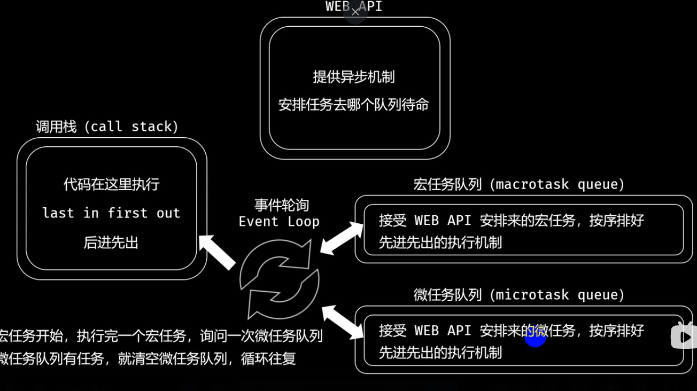

### 1.const定义一个对象，能用另一个对象替换？
```
不能，const声明一个只读常量，一旦声明，常量的值就不能改变。
```
### 2.JS内存泄漏有哪些情况？
```
1. 循环引用：当两个或多个对象之间存在相互引用，并且没有被其他对象引用，就会发生循环引用，从而导致内存泄漏。这种情况可以通过在对象之间断开引用来避免。
2. 定时器未清除：在JavaScript中使用setInterval和setTimeout函数时，必须确保在不需要他们时清除这些定时器。
3. DOM元素未正确删除：在使用JS操作DOM元素时，必须确保在不需要它们时正确删除它们。
4. 全部变量未清除：在JS中，如果定义了全局变量，它们将一直存在于内存中，直到页面关闭。如果不需要全局变量，请确保在使用后将其删除或赋值为null。
5. 闭包未正确使用：在JS中，闭包可以让函数访问其定义时的作用域，但如果未正确使用闭包，也可能导致内存泄漏。在使用闭包时，请确保只保留必要的引用，并在不需要时删除它们。
6. 事件未及时解绑：在JS中，如果注册了事件监听器却没有及时解绑，就会导致内存泄漏。例如当一个元素被删除时，它仍然保留对事件监听器的引用，如果没有解绑，事件监听器将无法被垃圾回收。
```
### 3.闭包为什么会造成内存泄漏？
```
闭包：1.父函数嵌套子函数，子函数访问父函数的局部变量。2.通过return返回这个子函数，暴露到全部作用域中，子函数形成了闭包。3.通过闭包，父函数的局部变量没有被销毁，可通过闭包去调用，但同时，这个局部变量也不会被全局变量污染。
闭包的作用与优缺点：
作用：
1）保护：保护函数的私有变量不被外部干扰。
2）保存：把一些函数内的值保存下来，闭包可以实现方法与属性的私有化。

优点：
1）延长局部变量的生命周期。
2）避免全局污染。
3）函数外部能访问函数内容的变量。

缺点：
1）闭包会携带包含其他的函数作用域，因此会比其他函数占用更多的内存。
2）不正当的使用可能会造成内存泄漏。

1. 难以控制：闭包能够访问外部函数的作用域，这意味着外部函数的变量可能会被闭包内部修改。如果这些变量不被正确处理，可能会导致内存泄漏。
2. 占用内存：闭包内部访问的变量通常不会被回收机制释放，因为它们被保存在了闭包的执行环境中。全局变量由于随时可以被任何程序在任何地方读写，所以回收机制很难统计何时需要释放全局变量所占用的内存，也就导致全局变量一般在全局执行环境被销毁时才会释放。闭包由于能够访问外部函数的变量，如果这些变量是引用类型（如Array、Object、Function），它们的值存储在堆内存中，而闭包的执行环境（栈内存）会引用这些变量，导致它们不会被回收机制释放，从而形成内存泄漏。
闭包本身不会直接造成内存泄漏，但如果在代码中过度使用闭包，并且没有正确处理闭包内部访问的变量，就可能存在内存泄漏的风险。
```
### 4.JS的数据类型
```
简单数据类型：string、number、boolean、null、undefined、symbol、bigInt
复杂数据类型：object(function、array。。。)
```
### 5.typeof和instanceof的区别
```
typeof能识别简单数据类型及函数，对于array和object无法区分，其中null 的检测值也为 object
instanceof用于检测构造函数的prototype是否出现在某个实例的原型链上，可以区分引用数据类型
```
### 6.实现一个类似关键字new功能的函数
```javascript
// new关键字：先创建一个空对象，将对象的__proto__指向构造函数的原型对象，然后将构造函数的this指向这个空对象，并执行构造函数的逻辑，根据构造函数的执行逻辑，返回初始创建的对象或构造函数的显式返回值。
function newFunc(...args) {
  const constructor = args.shift()
  const newInstance = Object.create(constructor.prototype)
  const res = constructor.apply(newInstance, args)
  return (typeof res === 'object' || typeof res === 'function') && res !== null ? res : newInstance
}
```
### 7.继承
```
1.原型链继承
  优点：
      1.父类方法可以复用
  缺点：
      1.父类的所有引用属性（info）会被所有子类共享，更改一个子类的引用属性，其他子类也会受影响
      2.子类型实例不能给父类型构造函数传参

2.借用构造函数继承
  优点:
      1.可以在子类构造函数中向父类传参数
      2.父类的引用属性不会被共享
  缺点：
      1.子类不能访问父类原型上定义的方法（即不能访问Parent.prototype上定义的方法），因此所有方法属性都写在构造函数中，每次创建实例都会初始化

3.组合继承
  优点：
      1.父类的方法可以复用
      2.可以在Child构造函数中向Parent构造函数中传参
      3.父类构造函数中的引用属性不会被共享

4.原型式继承
  优点：
      1.父类方法可复用
  缺点：
      1.父类的引用会被所有子类所共享
      2.子类实例不能向父类传参

5.寄生式继承
  优点：写法简单，不需要单独创建构造函数。
  缺点：通过寄生式继承给对象添加函数会导致函数难以重用。使用寄生式继承来为对象添加函数, 会由于不能做到函数复用而降低效率;这一点与构造函数模式类似.

6.寄生式组合继承
  优点：
      1.只调用一次父类构造函数
      2.Child可以向Parent传参
      3.父类方法可以复用
      4.父类的引用属性不会被共享

7.ES6类继承
```
### 8.箭头函数和普通函数的区别
```
1. 箭头函数没有自己的this,它的this就是外部作用域的this.
2. 箭头函数不能作为构造函数，没有prototype.
3. 箭头函数没有arguments对象，可以用rest代替
4. 箭头函数不能用yield命令，不能用作generator函数
```
### 9.迭代器(iterator)接口和生成器(generator)函数的关系
```
iterator遍历器是一种接口，为各种不同的数据结构提供统一的访问机制。任何数据结构只要部署Iterator接口，就可以完成遍历操作。
Iterator 的作用有三个：一是为各种数据结构，提供一个统一的、简便的访问接口；二是使得数据结构的成员能够按某种次序排列；三是 ES6 创造了一种新的遍历命令for...of循环，Iterator 接口主要供for...of消费。
ES6规定，默认的Iterator接口部署在数据结构的Symbol.iterator属性，或者说，一个数据结构只要有Symbol.iterator属性，就可以认为是可遍历的。Symbol.iterator本身是一个函数，默认的遍历器生成函数。执行这个函数就会返回一个遍历器
generator函数是一种异步编程解决方案，它就像一个状态机，封装了多个内部状态。执行generator函数会返回一个iterator对象，generator函数是一个状态机，也是遍历器生成函数。返回的遍历器对象可以依次遍历函数内部的每一个状态。
```
### 10.浏览器的事件循环机制


### 11.跨域
```
由于浏览器的同源策略（浏览器安全功能，它会阻止一个域与另一个域的内容进行交互，能有效防止XSS、CSRF攻击）的限制、非同源的请求会被限制。协议、域名、端口号
解决跨域：
    1. jsonp
    2. nginx反向代理
    3. iframe
    4. WebSocket
    5. 设置cors
```
### 12.浏览器的存储有哪些及区别
```
1. cookie: 有时效性，存储小4KB左右，http请求会携带
2. localStorage: 无时效性，除非手动保存，永久保存，存储大5MB左右
3. sessionStorage：关闭页面或浏览器会清除
4. indexDB
```
### 13.loader和plugin的区别
```
loader: 由于webpack只能打包commonjs规范的文件，因此针对css、图片等格式的文件没法打包，就需要引入第三方模块就行打包。loader扩展了webpack,只专注于文件转换，完成压缩，打包，翻译，仅仅只是为了打包。
plugin: plugin也是为了扩展webpack的功能，但是plugin是作用于webpack本身的。不局限于打包，资源加载上，解决loader无法实现的其他事。在整个编译周期起作用，在 Webpack 运行的生命周期中会广播出许多事件，Plugin 可以监听这些事件，在合适的时机通过Webpack提供的 API 改变输出结果。
```
### 14.深浅拷贝
```
浅拷贝将原对象或原数组的引用直接赋给新对象，新数组，新对象／数组只是原对象的一个引用（拷贝后的引用都是指向同一个对象的实例，彼此之间的操作会互相影响）

深拷贝是将原对象的各个属性的“值”逐个复制出去，而且将原对象各个属性所包含的对象也依次采用深拷贝的方法递归复制到新对象上（注意拷贝的“值”而不是“引用”）

深拷贝的方式：
    1.JSON.parse(JSON.stringify()), function和undefined无法拷贝
    2.递归
    3.jquery的$.extend(true, {}, obj)
    4.只有一层时，Object.assign({}, obj)
    5.只有一层时，扩展运算符(...)
```
### 15.防抖和节流
```
防抖(debounce): 当一个事件连续被触发时，防抖技术将只执行最后一次触发事件的函数调用。(n秒之后才触发函数调用，n秒内如果被连续触发，则重新计时)
使用防抖的场景： - 搜索框输入联想：用户在输入时，如果一直输入，会频繁触发搜索请求，使用防抖可以减少请求的次数，只在用户停止输入后才发送请求。 - 页面滚动加载更多：当用户滚动页面时，会频繁触发加载更多数据的函数，使用防抖可以减少请求的次数，只在用户停止滚动后才发送请求。

节流(throttle): 当一个事件被连续触发时，节流技术会限制函数的执行频率，函数在一段时间内只会执行一次。(n秒内只运行一次，若在n秒内重复触发，只有一次生效)
使用节流的场景： - 页面滚动事件：当用户滚动页面时，会触发滚动事件，如果不使用节流技术，可能会导致页面卡顿。使用节流可以限制滚动事件的触发频率，减少卡顿现象。
```
### 16.首屏加载如何优化
```
1.减小入口文件的体积
2.静态资源本地缓存
3.UI框架按需加载
4.图片资源的压缩
5.组件重复打包
6.开启Gzip压缩
7.使用ssr
```
### 17.作用域和作用域链
```
作用域是定义变量的区域，它有一套访问变量的规则，这套规则来管理浏览器引擎如何在当前作用域以及嵌套的作用域中根据变量（标识符）进行变量查找。

作用域链的作用是保证对执行环境有权访问的所有变量和函数的有序访问，通过作用域链，我们可以访问到外层环境的变量和 函数。
​
作用域链的本质上是一个指向变量对象的指针列表。变量对象是一个包含了执行环境中所有变量和函数的对象。作用域链的前 端始终都是当前执行上下文的变量对象。全局执行上下文的变量对象（也就是全局对象）始终是作用域链的最后一个对象。
​
当我们查找一个变量时，如果当前执行环境中没有找到，我们可以沿着作用域链向后查找。
​
作用域链的创建过程跟执行上下文的建立有关
```
### 18.js延迟加载的方式
```
js 的加载、解析和执行会阻塞页面的渲染过程，因此我们希望 js 脚本能够尽可能的延迟加载，提高页面的渲染速度。
​
1.  将 js 脚本放在文档的底部，来使 js 脚本尽可能的在最后来加载执行。
2.  给 js 脚本添加 defer 属性，这个属性会让脚本的加载与文档的解析同步解析，然后在文档解析完成后再执行这个脚本文件，这样的话就能使页面的渲染不被阻塞。多个设置了 defer 属性的脚本按规范来说最后是顺序执行的，但是在一些浏览器中可能不是这样。
3.  给 js 脚本添加 async 属性，这个属性会使脚本异步加载，不会阻塞页面的解析过程，但是当脚本加载完成后立即执行 js 脚本，这个时候如果文档没有解析完成的话同样会阻塞。多个 async 属性的脚本的执行顺序是不可预测的，一般不会按照代码的顺序依次执行。
4.  动态创建 DOM 标签的方式，我们可以对文档的加载事件进行监听，当文档加载完成后再动态的创建 script 标签来引入 js 脚本。
```
### 19.js的几种模块规范
```
js 中现在比较成熟的有四种模块加载方案：
​
*   第一种是 CommonJS 方案，它通过 require 来引入模块，通过 module.exports 定义模块的输出接口。这种模块加载方案是服务器端的解决方案，它是以同步的方式来引入模块的，因为在服务端文件都存储在本地磁盘，所以读取非常快，所以以同步的方式加载没有问题。但如果是在浏览器端，由于模块的加载是使用网络请求，因此使用异步加载的方式更加合适。
*   第二种是 AMD 方案，这种方案采用异步加载的方式来加载模块，模块的加载不影响后面语句的执行，所有依赖这个模块的语句都定义在一个回调函数里，等到加载完成后再执行回调函数。require.js 实现了 AMD 规范。
*   第三种是 CMD 方案，这种方案和 AMD 方案都是为了解决异步模块加载的问题，sea.js 实现了 CMD 规范。它和 require.js 的区别在于模块定义时对依赖的处理不同和对依赖模块的执行时机的处理不同。
*   第四种方案是 ES6 提出的方案，使用 import 和 export 的形式来导入导出模块。
```
### 20.AMD和CMD的区别
```
1.  第一个方面是在模块定义时对依赖的处理不同。AMD 推崇依赖前置，在定义模块的时候就要声明其依赖的模块。而 CMD 推崇就近依赖，只有在用到某个模块的时候再去 require。
2.  第二个方面是对依赖模块的执行时机处理不同。首先 AMD 和 CMD 对于模块的加载方式都是异步加载，不过它们的区别在于 模块的执行时机，AMD 在依赖模块加载完成后就直接执行依赖模块，依赖模块的执行顺序和我们书写的顺序不一定一致。而 CMD 在依赖模块加载完成后并不执行，只是下载而已，等到所有的依赖模块都加载好后，进入回调函数逻辑，遇到 require 语句 的时候才执行对应的模块，这样模块的执行顺序就和我们书写的顺序保持一致了。
```
### 21.V8引擎的垃圾回收机制
```
v8 的垃圾回收机制基于分代回收机制，这个机制又基于世代假说，这个假说有两个特点，一是新生的对象容易早死，另一个是不死的对象会活得更久。基于这个假说，v8 引擎将内存分为了新生代和老生代。
​
新创建的对象或者只经历过一次的垃圾回收的对象被称为新生代。经历过多次垃圾回收的对象被称为老生代。
​
新生代被分为 From 和 To 两个空间，To 一般是闲置的。当 From 空间满了的时候会执行 Scavenge 算法进行垃圾回收。当我们执行垃圾回收算法的时候应用逻辑将会停止，等垃圾回收结束后再继续执行。这个算法分为三步：
​
（1）首先检查 From 空间的存活对象，如果对象存活则判断对象是否满足晋升到老生代的条件，如果满足条件则晋升到老生代。如果不满足条件则移动 To 空间。
​
（2）如果对象不存活，则释放对象的空间。
​
（3）最后将 From 空间和 To 空间角色进行交换。
​
新生代对象晋升到老生代有两个条件：
​
（1）第一个是判断是对象否已经经过一次 Scavenge 回收。若经历过，则将对象从 From 空间复制到老生代中；若没有经历，则复制到 To 空间。
​
（2）第二个是 To 空间的内存使用占比是否超过限制。当对象从 From 空间复制到 To 空间时，若 To 空间使用超过 25%，则对象直接晋升到老生代中。设置 25% 的原因主要是因为算法结束后，两个空间结束后会交换位置，如果 To 空间的内存太小，会影响后续的内存分配。
​
老生代采用了标记清除法和标记压缩法。标记清除法首先会对内存中存活的对象进行标记，标记结束后清除掉那些没有标记的对象。由于标记清除后会造成很多的内存碎片，不便于后面的内存分配。所以了解决内存碎片的问题引入了标记压缩法。
​
由于在进行垃圾回收的时候会暂停应用的逻辑，对于新生代方法由于内存小，每次停顿的时间不会太长，但对于老生代来说每次垃圾回收的时间长，停顿会造成很大的影响。 为了解决这个问题 V8 引入了增量标记的方法，将一次停顿进行的过程分为了多步，每次执行完一小步就让运行逻辑执行一会，就这样交替运行。
```
### 22.http缓存
```
http缓存：强缓存和协商缓存

强缓存：浏览器在加载资源时，会先根据本地缓存资源的 header 中的信息判断是否命中强缓存，如果命中则直接使用缓存中的资源不会再向服务器发送请求。

这里的 header 中的信息指的是 expires 和 cahe-control.

Expires
该字段是 http1.0 时的规范，它的值为一个绝对时间的 GMT 格式的时间字符串，比如 Expires:Mon,18 Oct 2066 23:59:59 GMT。这个时间代表着这个资源的失效时间，在此时间之前，即命中缓存。这种方式有一个明显的缺点，由于失效时间是一个绝对时间，所以当服务器与客户端时间偏差较大时，就会导致缓存混乱（本地时间也可以随便更改）。
Cache-Control（优先级高于 Expires）

Cache-Control 是 http1.1 时出现的 header 信息，主要是利用该字段的 max-age 值来进行判断，它是一个相对时间，例如 Cache-Control:max-age=3600，代表着资源的有效期是 3600 秒。cache-control 除了该字段外，还有下面几个比较常用的设置值：

no-cache：需要进行协商缓存，发送请求到服务器确认是否使用缓存。
no-store：禁止使用缓存，每一次都要重新请求数据。
public：可以被所有的用户缓存，包括终端用户和 CDN 等中间代理服务器。
private：只能被终端用户的浏览器缓存，不允许 CDN 等中继缓存服务器对其缓存。
Cache-Control 与 Expires 可以在服务端配置同时启用，同时启用的时候 Cache-Control 优先级高。

协商缓存：

当强缓存没有命中的时候，浏览器会发送一个请求到服务器，服务器根据 header 中的部分信息来判断是否命中缓存。如果命中，则返回 304 ，告诉浏览器资源未更新，可使用本地的缓存。

这里的 header 中的信息指的是 Last-Modify/If-Modify-Since 和 ETag/If-None-Match.

Last-Modify/If-Modify-Since
浏览器第一次请求一个资源的时候，服务器返回的 header 中会加上 Last-Modify，Last-modify 是一个时间标识该资源的最后修改时间（只能精确到秒，所以间隔时间小于 1 秒的请求是检测不到文件更改的。）。
当浏览器再次请求该资源时，request 的请求头中会包含 If-Modify-Since，该值为缓存之前返回的 Last-Modify。服务器收到 If-Modify-Since 后，根据资源的最后修改时间判断是否命中缓存。

如果命中缓存，则返回 304，并且不会返回资源内容，并且不会返回 Last-Modify。

缺点:
短时间内资源发生了改变，Last-Modified 并不会发生变化。
周期性变化。如果这个资源在一个周期内修改回原来的样子了，我们认为是可以使用缓存的，但是 Last-Modified 可不这样认为, 因此便有了 ETag。

ETag/If-None-Match
Etag 是基于文件内容进行编码的，可以保证如果服务器有更新，一定会重新请求资源，但是编码需要付出额外的开销。
与 Last-Modify/If-Modify-Since 不同的是，Etag/If-None-Match 返回的是一个校验码。ETag 可以保证每一个资源是唯一的，资源变化都会导致 ETag 变化。服务器根据浏览器上送的 If-None-Match 值来判断是否命中缓存。

与 Last-Modified 不一样的是，当服务器返回 304 Not Modified 的响应时，由于 ETag 重新生成过，response header 中还会把这个 ETag 返回，即使这个 ETag 跟之前的没有变化。

Last-Modified 与 ETag 是可以一起使用的，服务器会优先验证 ETag，一致的情况下，才会继续比对 Last-Modified，最后才决定是否返回 304。
```
### 23.打开Chrome浏览器一个Tab页面，至少会出现几个进程？
```
最新的 Chrome 浏览器包括至少四个: 1 个浏览器（Browser）主进程、1 个 GPU 进程、1 个网络（NetWork）进程、多个渲染进程和多个插件进程, 当然还有复杂的情况；
​
页面中有 iframe 的话, iframe 会单独在进程中
​
有插件的话，插件也会开启进程
​
多个页面属于同一站点，并且从 a 打开 b 页面，会共用一个渲染进程
​
装了扩展的话，扩展也会占用进程
​
这些进程都可以通过 Chrome 任务管理器来查看
```
### 24.即使如今多进程架构，还是会碰到单页面卡死的最终崩溃导致所有页面崩溃的情况
```
提供一种情况，就是同一站点, 围绕这个展开也行。
​
Chrome 的默认策略是，每个标签对应一个渲染进程。但是如果从一个页面打开了新页面，而新页面和当前页面属于同一站点时，那么新页面会复用父页面的渲染进程。官方把这个默认策略叫 process-per-site-instance。
​
更加简单的来说，就是如果多个页面符合同一站点，这几个页面会分配到一个渲染进程中去, 所以有这样子的一种情况, 一个页面崩溃了，会导致同一个站点的其他页面也奔溃，这是因为它们使用的是同一个渲染进程。
​
有人会问为什么会跑到一个进程里面呢?
​
你想一想呀, 属于同一家的站点，比如下面三个:
​
https://time.geekbang.org
https://www.geekbang.org
https://www.geekbang.org:8080
它们在一个渲染进程中的话，它们就会共享 JS 执行环境，也就是 A 页面可以直接在 B 页面中执行脚本了, 有些时候就是有这样子的需求嘛。
```
### 25.TCP建立连接过程讲一讲，为什么握手需要三次？
```
**三次握手**
​
第一次握手
客户端向服务端发送连接请求报文段。该报文段的头部中 SYN=1，ACK=0，seq=x。请求发送后，客户端便进入 SYN-SENT 状态。
​
PS1：SYN=1，ACK=0 表示该报文段为连接请求报文。
PS2：x 为本次 TCP 通信的字节流的初始序号。
TCP 规定：SYN=1 的报文段不能有数据部分，但要消耗掉一个序号。
第二次握手
服务端收到连接请求报文段后，如果同意连接，则会发送一个应答：SYN=1，ACK=1，seq=y，ack=x+1。
该应答发送完成后便进入 SYN-RCVD 状态。
​
PS1：SYN=1，ACK=1 表示该报文段为连接同意的应答报文。
PS2：seq=y 表示服务端作为发送者时，发送字节流的初始序号。
PS3：ack=x+1 表示服务端希望下一个数据报发送序号从 x+1 开始的字节。
第三次握手
当客户端收到连接同意的应答后，还要向服务端发送一个确认报文段，表示：服务端发来的连接同意应答已经成功收到。
该报文段的头部为：ACK=1，seq=x+1，ack=y+1。
客户端发完这个报文段后便进入 ESTABLISHED 状态，服务端收到这个应答后也进入 ESTABLISHED 状态，此时连接的建立完成！
​
**为什么连接建立需要三次握手，而不是两次握手**
​
在谢希仁著《计算机网络》第四版中讲 “三次握手” 的目的是 “为了防止已失效的连接请求报文段突然又传送到了服务端，因而产生错误”。在另一部经典的《计算机网络》一书中讲“三次握手” 的目的是为了解决 “网络中存在延迟的重复分组” 的问题。这两种不用的表述其实阐明的是同一个问题。
​
谢希仁版《计算机网络》中的例子是这样的，“已失效的连接请求报文段”的产生在这样一种情况下：client 发出的第一个连接请求报文段并没有丢失，而是在某个网络结点长时间的滞留了，以致延误到连接释放以后的某个时间才到达 server。本来这是一个早已失效的报文段。但 server 收到此失效的连接请求报文段后，就误认为是 client 再次发出的一个新的连接请求。于是就向 client 发出确认报文段，同意建立连接。假设不采用 “三次握手”，那么只要 server 发出确认，新的连接就建立了。由于现在 client 并没有发出建立连接的请求，因此不会理睬 server 的确认，也不会向 server 发送数据。但 server 却以为新的运输连接已经建立，并一直等待 client 发来数据。这样，server 的很多资源就白白浪费掉了。采用“三次握手” 的办法可以防止上述现象发生。例如刚才那种情况，client 不会向 server 的确认发出确认。server 由于收不到确认，就知道 client 并没有要求建立连接。”
​
​
**四次挥手**
​
第一次挥手
若 A 认为数据发送完成，则它需要向 B 发送连接释放请求。该请求只有报文头，头中携带的主要参数为：
FIN=1，seq=u。此时，A 将进入 FIN-WAIT-1 状态。
​
PS1：FIN=1 表示该报文段是一个连接释放请求。
PS2：seq=u，u-1 是 A 向 B 发送的最后一个字节的序号。
第二次挥手
B 收到连接释放请求后，会通知相应的应用程序，告诉它 A 向 B 这个方向的连接已经释放。此时 B 进入 CLOSE-WAIT 状态，并向 A 发送连接释放的应答，其报文头包含：
ACK=1，seq=v，ack=u+1。
​
PS1：ACK=1：除 TCP 连接请求报文段以外，TCP 通信过程中所有数据报的 ACK 都为 1，表示应答。
PS2：seq=v，v-1 是 B 向 A 发送的最后一个字节的序号。
PS3：ack=u+1 表示希望收到从第 u+1 个字节开始的报文段，并且已经成功接收了前 u 个字节。
A 收到该应答，进入 FIN-WAIT-2 状态，等待 B 发送连接释放请求。
​
第二次挥手完成后，A 到 B 方向的连接已经释放，B 不会再接收数据，A 也不会再发送数据。但 B 到 A 方向的连接仍然存在，B 可以继续向 A 发送数据。
​
第三次挥手
当 B 向 A 发完所有数据后，向 A 发送连接释放请求，请求头：FIN=1，ACK=1，seq=w，ack=u+1。B 便进入 LAST-ACK 状态。
​
第四次挥手
A 收到释放请求后，向 B 发送确认应答，此时 A 进入 TIME-WAIT 状态。该状态会持续 2MSL 时间，若该时间段内没有 B 的重发请求的话，就进入 CLOSED 状态，撤销 TCB。当 B 收到确认应答后，也便进入 CLOSED 状态，撤销 TCB。
​
为什么 A 要先进入 TIME-WAIT 状态，等待 2MSL 时间后才进入 CLOSED 状态？
为了保证 B 能收到 A 的确认应答。
若 A 发完确认应答后直接进入 CLOSED 状态，那么如果该应答丢失，B 等待超时后就会重新发送连接释放请求，但此时 A 已经关闭了，不会作出任何响应，因此 B 永远无法正常关闭。
```
### 26.什么事CDN
```
全称 Content Delivery Network, 即内容分发网络。
​
摘录一个形象的比喻, 来理解 CDN 是什么。
​
10 年前，还没有火车票代售点一说，12306.cn 更是无从说起。那时候火车票还只能在火车站的售票大厅购买，而我所在的小县城并不通火车，火车票都要去市里的火车站购买，而从我家到县城再到市里，来回就是 4 个小时车程，简直就是浪费生命。后来就好了，小县城里出现了火车票代售点，甚至乡镇上也有了代售点，可以直接在代售点购买火车票，方便了不少，全市人民再也不用在一个点苦逼的排队买票了。
​
简单的理解 CDN 就是这些代售点 (缓存服务器) 的承包商, 他为买票者提供了便利, 帮助他们在最近的地方 (最近的 CDN 节点) 用最短的时间 (最短的请求时间) 买到票(拿到资源), 这样去火车站售票大厅排队的人也就少了。也就减轻了售票大厅的压力(起到分流作用, 减轻服务器负载压力)。
​
用户在浏览网站的时候，CDN 会选择一个离用户最近的 CDN 边缘节点来响应用户的请求，这样海南移动用户的请求就不会千里迢迢跑到北京电信机房的服务器（假设源站部署在北京电信机房）上了。
​
CDN 缓存
关于 CDN 缓存, 在浏览器本地缓存失效后, 浏览器会向 CDN 边缘节点发起请求。类似浏览器缓存, CDN 边缘节点也存在着一套缓存机制。CDN 边缘节点缓存策略因服务商不同而不同，但一般都会遵循 http 标准协议，通过 http 响应头中的
​
Cache-control: max-age   //后面会提到
的字段来设置 CDN 边缘节点数据缓存时间。
​
当浏览器向 CDN 节点请求数据时，CDN 节点会判断缓存数据是否过期，若缓存数据并没有过期，则直接将缓存数据返回给客户端；否则，CDN 节点就会向服务器发出回源请求，从服务器拉取最新数据，更新本地缓存，并将最新数据返回给客户端。 CDN 服务商一般会提供基于文件后缀、目录多个维度来指定 CDN 缓存时间，为用户提供更精细化的缓存管理。
​
CDN 优势
CDN 节点解决了跨运营商和跨地域访问的问题，访问延时大大降低。
大部分请求在 CDN 边缘节点完成，CDN 起到了分流作用，减轻了源服务器的负载。
```
### 27.HTTP和HTTPS的区别？
```
HTTPS是HTTP协议的安全版本，HTTP协议的数据传输是明文的，是不安全的，HTTPS使用了SSL/TLS协议进行了加密处理，相对更安全
HTTP 和 HTTPS 使用连接方式不同，默认端口也不一样，HTTP是80，HTTPS是443
HTTPS 由于需要设计加密以及多次握手，性能方面不如 HTTP
HTTPS需要SSL，SSL 证书需要钱，功能越强大的证书费用越高
```
### 28.webpack文件指纹策略：hash chunkhash contenthash
```
hash策略：是以项目为单位的，项目内容改变则会生成新的hash，内容不变则hash不变
​
chunkhash策略：是以chunk为单位的，当一个文件内容改变，则整个相应的chunk组模块的hash回发生改变
​
contenthash策略：是以自身内容为单为的
​
推荐使用：css ：contenthash
​
•js：chunkhash
```
### 29.webpack的构建流程
```
1.初始化参数：解析webpack配置参数，合并shell传入和webpack.config.js文件配置的参数，形成最后的配置结果。
2.开始编译：上一步得到的参数初始化compiler对象，注册所有配置的插件，插件监听webpack构建生命周期的事件节点，做出相应的反应，执行对象的 run 方法开始执行编译。
3.确定入口：从配置的entry入口，开始解析文件构建AST语法树，找出依赖，递归下去。
4.编译模块：递归中根据文件类型和loader配置，调用所有配置的loader对文件进行转换，再找出该模块依赖的模块，再递归本步骤直到所有入口依赖的文件都经过了本步骤的处理。
5.完成模块编译：在经过第4步使⽤ Loader 翻译完所有模块后，得到了每个模块被翻译后的最终内容以及它们之间的依赖关系；
6.输出资源：根据⼊⼝和模块之间的依赖关系，组装成⼀个个包含多个模块的 Chunk，再把每个 Chunk 转换成⼀个单独的⽂件加⼊到输出列表，这步是可以修改输出内容的最后机会；
7.输出完成：在确定好输出内容后，根据配置确定输出的路径和⽂件名，把⽂件内容写⼊到⽂件系统。
```
### 30.webpack热更新是怎么做到的
```
通过webpack-dev-server创建两个服务器：提供静态资源的服务（express）和Socket服务
express server 负责直接提供静态资源的服务（打包后的资源直接被浏览器请求和解析）
socket server 是一个 websocket 的长连接，双方可以通信
当 socket server 监听到对应的模块发生变化时，会生成两个文件.json（manifest文件）和.js文件（update chunk）
通过长连接，socket server 可以直接将这两个文件主动发送给客户端（浏览器）
浏览器拿到两个新的文件后，通过HMR runtime机制，加载这两个文件，并且针对修改的模块进行更新
```